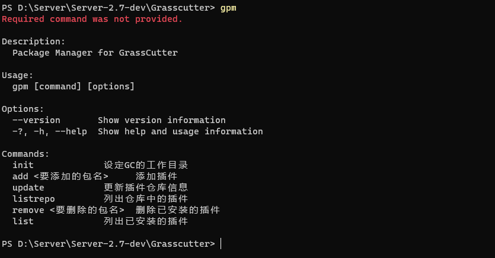
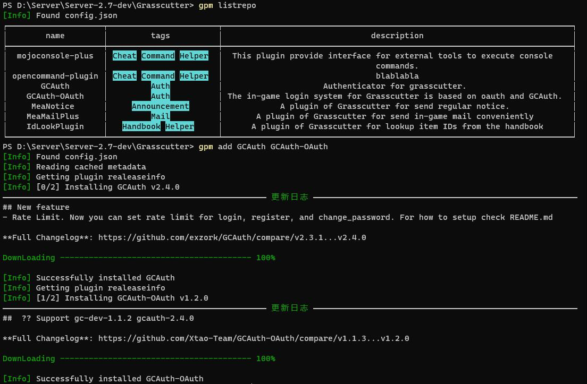
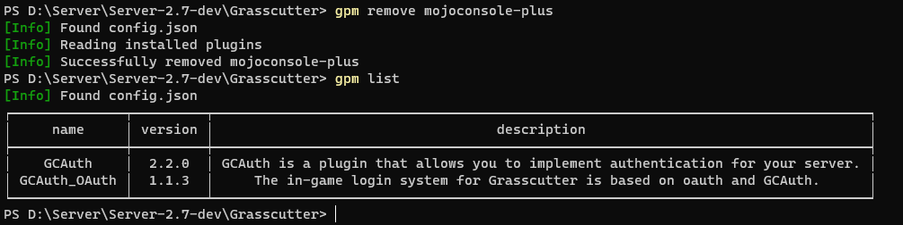

# GCPkgMgr
A package manager for grasscutter

## 展示





## 安装

1. 前往 [Release](https://github.com/SwetyCore/GCPkgMgr/releases) 寻找操作系统对应的压缩包
2. 解压到任意目录
3. + 对于 Windows ：添加环境变量
   + 对于 Linux : 在 gc 目录下添加指向 gpm 的软连接即可
4. 开始使用吧！
   
## 功能&TODO

- [x] 插件管理相关
  - [x] 插件列表
  - [x] 插件商店
  - [x] 插件安装
  - [x] 插件删除
  - [ ] 插件版本切换
  - [ ] 插件更新
  - [ ] 插件安装之后的后续使用提示
- [x] GC 资源相关
    - [x] 更新 GC 本体
    - [x] 更新 GC 的 Resource


## 命令帮助

```
Description:
  Package Manager for GrassCutter

Usage:
  gpm [command] [options]

Options:
  --version       Show version information
  -?, -h, --help  Show help and usage information

Commands:
  init             已弃用
  add <要添加的包名>     添加插件
  update           更新仓库信息
  listrepo         列出仓库中的插件
  remove <要删除的包名>  删除已安装的插件
  list             列出已安装的插件
  install          在文件夹下安装GrassCutter
  ```

## 提醒
此软件功能尚未完善，~~并且只编译了 Windows 版本。
对于有需要的人请自行下载编译其他平台的版本。~~

