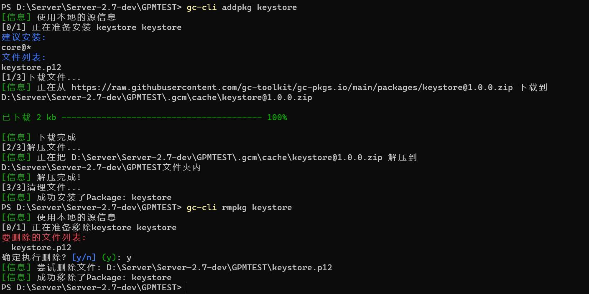

# ~~GCPkgMgr~~ gc-cli
Grasscutter 资源管理助手(确信)


## 展示




## 安装

1. 前往 [Release](https://github.com/SwetyCore/GCPkgMgr/releases) 寻找操作系统对应的压缩包
2. 解压到任意目录
3. + 对于 Windows ：添加环境变量（偷懒可以直接把下载的exe文件放在要安装的文件夹里）
   + 对于 Linux : 在 gc 目录下添加指向 gpm 的软连接即可
4. 开始使用吧！
   
## 功能&TODO

- [x] 插件管理相关
  - [x] 插件列表
  - [x] 插件商店
  - [x] 插件安装
  - [x] 插件删除
  - [ ] 插件版本切换
  - [ ] 插件更新
  - [ ] 插件安装之后的后续使用提示
- [x] GC 资源相关
    - [x] 更新 GC 本体
    - [x] 更新 GC 的 Resource


## 命令帮助
> 小小的提示一下：在命令后添加 -p 选项可以启用代理下载功能喔! 可能对无法正常访问 github 的小伙伴有帮助！

首先把下载下来的文件拖到想安装gc的文件夹里  
然后打开终端(cmd 或者 powershell)
### 快速开始
1. 当然是更新源啦  
```
gc-cli update
```
2. 安装核心文件（后面加上 -v 1.2.2-dev-0141dce 即可安装指定版本！）
```
gc-cli install
```
3. 安装资源文件
```
gc-cli install -t res
```
> 其实在这一步就算安装完成了，直接执行 `gc-cli run` 启动服务器也没有什么问题。

### 插件相关
+ 要安装插件肯定要知道插件的名称啦，使用下面的命令列出所有可使用的插件
```
gc-cli listplui
```
+ 既然知道了插件名称那么接下来就可以安装所需的插件啦！  
`下面的命令安装了 GCAuth GCAuth-OAuth 两个插件`
```
gc-cli addplu GCAuth GCAuth-OAuth
```
+ 插件不想要了？使用下面的命令删除它！
```
gc-cli rmplu GCAuth-OAuth
```
### Package相关
+ 同样是列出所有可用的Package！
```
gc-cli listpkgi
```
+ 然后添加你想要的  

  `keystore.p12` 文件应该是服务器启用 https 必需的东西，建议安装。
```
gc-cli addpkg keystore
```
+ 删除也是一样的
```
gc-cli rmpkg keystore
```

### 最后就是开启服务器啦
输入下面的指令，然后回车！如果不出意外服务器就正式跑起来了，记得修改 config.json 文件喔！
```
gc-cli run
```

## 提醒
此软件正处于测试中，并且只编译了 Windows 版本。
对于有需要的人请自行下载编译其他平台的版本。

